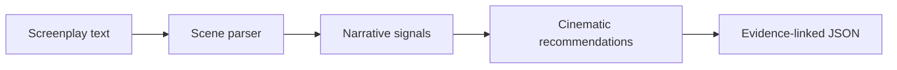

# Generative Cinema AI

Generative Cinema AI converts screenplay text into an explainable cinematic plan. It reads each scene, identifies narrative signals such as tension, intimacy, movement, or wonder, and recommends how that scene could be photographed.

For every analyzed scene, the system proposes:

- shot framing and composition;
- lighting and color treatment;
- lens and depth-of-field choices;
- camera movement;
- visual texture; and
- a rationale linked to the exact screenplay text that influenced the recommendation.

The project is designed as the foundation of a larger filmmaking platform: **screenplay intelligence and shot planning first, storyboard generation second, and video previsualization third**.

## Why it exists

Screenplays describe story, performance, action, and dialogue, but they rarely provide a complete visual-production plan. Generative Cinema AI helps translate written narrative into structured visual choices that a writer, director, cinematographer, student, or production team can review and refine.

It is intended to support creative judgment—not replace the director or cinematographer. Recommendations are editable proposals, and confidence values describe the strength of a detected text signal rather than the artistic quality of a choice.

## How it works

1. Submit a screenplay or scene as Fountain-formatted or plain text.
2. The parser separates the screenplay into scenes and preserves source offsets.
3. The analysis engine detects supported narrative signals in each scene.
4. The engine produces five categories of cinematic recommendations.
5. Every recommendation includes a rationale, confidence value, alternatives, and screenplay evidence.
6. The result is returned as structured JSON for use by a command-line tool, application, or future production interface.



## Example

Input:

```text
INT. VAULT - NIGHT

A guard shouts. Mara sprints toward the closing steel door.
```

The current deterministic engine detects a kinetic signal and can recommend:

| Category | Example recommendation |
|---|---|
| Frame | Wide-to-medium coverage that preserves action geography |
| Lighting | Hard directional sources with readable separation |
| Lens | 28mm lens for speed and spatial energy |
| Movement | Motivated tracking movement with stable geography |
| Texture | Crisp contrast with selective motion blur |

The JSON result also contains the analyzed scene, detected signals, exact supporting text spans, rationale, confidence, alternatives, provider name, provider version, tenant/project trace IDs, and a unique run ID.

## Current capabilities

- Fountain scene-heading recognition and explicit plain-text mode
- Exact screenplay source spans for traceability
- Scene-specific, deterministic cinematic recommendations
- Evidence-backed rationale for each recommendation
- Strict versioned Pydantic request and response models
- Provider protocol for future LLM and media-service adapters
- FastAPI health and synchronous analysis endpoints
- JSON command-line interface
- Request-size limits and screenplay-safe validation responses
- Automated unit, API, evaluation, and security regression tests
- Docker packaging and GitHub Actions continuous integration

## Current status

This release is a **local working prototype**, not an enterprise-ready service.

Use it locally with synthetic, public-domain, owned, or properly licensed screenplay material. It does not yet provide authentication, authorization, secure persistence, database tenant isolation, verified deletion, collaboration, billing, SSO/SCIM, production monitoring, storyboard generation, or video generation.

Although requests contain `tenant_id` and `project_id`, those values are currently trace identifiers only. They do not enforce access control or tenant isolation. Do not expose this API to a network or submit confidential screenplay material.

## Quick start

Python 3.11 or newer is required.

```bash
git clone https://github.com/Abraham75/generative_cinema_ai.git
cd generative_cinema_ai
python -m venv .venv
source .venv/bin/activate
python -m pip install -e '.[dev]'
pytest
generative-cinema sample_script.fountain
```

On Windows PowerShell, activate the environment with:

```powershell
.venv\Scripts\Activate.ps1
```

## Run the API

Keep the server bound to the loopback interface:

```bash
uvicorn generative_cinema_ai.api:app --host 127.0.0.1 --reload
```

Open `http://127.0.0.1:8000/docs` for the interactive API documentation, or submit an analysis request directly:

```bash
curl -X POST http://127.0.0.1:8000/v1/analysis \
  -H 'Content-Type: application/json' \
  -d '{"tenant_id":"00000000-0000-0000-0000-000000000001","project_id":"00000000-0000-0000-0000-000000000002","screenplay_text":"INT. VAULT - NIGHT\nA guard shouts. Mara sprints.","input_format":"fountain"}'
```

Available endpoints:

| Method | Endpoint | Purpose |
|---|---|---|
| `GET` | `/health` | Return application health and version |
| `POST` | `/v1/analysis` | Parse screenplay text and return scene-level cinematic recommendations |

## Input modes

| Mode | Behavior |
|---|---|
| `fountain` | Recognizes the supported Fountain scene-heading subset and preserves title or preamble text as an explicitly marked scene |
| `plain_text` | Treats the complete submission as one scene |
| `auto` | Uses recognized scene headings when present and otherwise falls back to one plain-text scene |

Supported scene headings begin with `INT.`, `EXT.`, `INT./EXT.`, or `EXT./INT.`. This prototype is not yet a complete implementation of the Fountain specification. PDF, DOCX, FDX, OCR, and secure file-upload workflows are planned rather than currently supported.

## Safety defaults

- Request bodies are limited to 525,000 bytes by default.
- Validation responses omit submitted values so screenplay content is not echoed.
- Non-loopback clients are rejected by default.
- Outside development mode, startup fails unless network use is deliberately enabled.
- Enabling `ALLOW_NETWORK_API=true` does **not** add authentication, authorization, encryption, or tenant isolation.

A production deployment must add an authenticated gateway, body-free logging, encrypted storage, tenant enforcement, retention and deletion policies, secrets management, audit logging, rate limiting, and legal review.

## Project structure

```text
src/generative_cinema_ai/
├── api.py          # FastAPI transport and safety handling
├── cli.py          # Command-line interface
├── models.py       # Versioned domain and API contracts
├── parser.py       # Screenplay parsing and source provenance
├── providers.py    # Analysis-provider protocol and deterministic engine
├── service.py      # Transport-independent orchestration
└── settings.py     # Environment and network-safety configuration

tests/              # Unit, API, evaluation, and regression tests
product/PRD.md      # Product requirements and acceptance criteria
docs/architecture.md
research/evidence-register.md
reviews/postimplementation-red-team.md
```

The original root-level cinematic modules remain for historical reference. New development should use the packaged implementation under `src/generative_cinema_ai`.

## Product roadmap

### Stage 1 — Screenplay intelligence and shot planning

- richer screenplay structure and beat detection;
- policy-controlled third-party LLM adapters;
- editable and versioned visual treatments;
- shot-list and production-document exports;
- human creative evaluation; and
- secure projects, identity, permissions, and tenant isolation.

### Stage 2 — Storyboard generation

- provider-controlled image generation;
- character, location, wardrobe, and visual-style continuity;
- rights and provenance records;
- review, approval, regeneration, and comparison workflows; and
- storyboard and pitch-package exports.

### Stage 3 — Video previsualization

- shot-to-video generation adapters;
- temporal and character continuity controls;
- cost, queue, safety, and provider-policy management;
- versioned video review workflows; and
- enterprise licensing and deployment options.

These capability stages are separate from maturity labels such as prototype, MVP, beta, and production-ready. Advancement requires passing the product, security, legal, operational, and human-evaluation gates documented in the repository.

## Documentation

- [Product requirements](product/PRD.md)
- [Target architecture](docs/architecture.md)
- [Current-state audit](docs/current-state-audit.md)
- [Product narrative](docs/product-narrative.md)
- [Research evidence register](research/evidence-register.md)
- [Postimplementation red-team review](reviews/postimplementation-red-team.md)

## Responsible use

Only process material you own or have permission to use. Generated recommendations and future generated media require human review for creative suitability, copyright, likeness, privacy, contractual, and provider-policy considerations. Nothing produced by this software establishes legal clearance or ownership.
