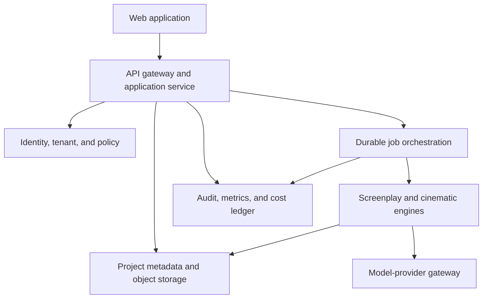

# Generative Cinema AI: Target Enterprise Architecture

**Status:** Proposed architecture for reconciliation; no application implementation authorized in this phase  
**Product direction:** Licensable enterprise platform, usable by individual filmmakers, production teams, film schools, and studios  
**Delivery strategy:** One platform with tiered capabilities, staged from screenplay intelligence to shot planning, storyboards, and video generation

## 1. Architectural principles

1. **The screenplay remains authoritative.** Every extracted fact and recommendation links to source spans; generated content never silently rewrites source material.
2. **Human creative control is mandatory.** Users approve, edit, lock, reject, regenerate, and compare recommendations.
3. **Providers are replaceable.** Business logic depends on internal ports, not vendor SDK objects.
4. **Schemas precede prompts.** All model outputs are validated against versioned domain contracts.
5. **Tenancy is structural.** Tenant context is required in identity, authorization, storage, jobs, logs, budgets, and exports.
6. **Async by default for expensive work.** Upload parsing, screenplay analysis, image generation, and video generation run as durable jobs.
7. **Progressive product depth.** A useful text-first workflow ships before high-cost image/video generation.
8. **Evaluation is multi-layered.** Deterministic correctness, faithfulness, creative usefulness, safety, latency, and cost are measured separately.

## 2. Product surfaces by audience

| Audience | Shared core | Specialized capability |
|---|---|---|
| Individual filmmaker | Upload, analyze, edit, export | Simple onboarding, templates, usage budgets |
| Production team | Shared projects, comments, approvals | Role-based workflow, versions, review states |
| Film school | Guided analysis and shot rationale | Classroom workspaces, rubrics, instructor review |
| Studio | Portfolio administration and governance | SSO/SCIM, policy controls, audit export, private connectivity/deployment options |

Avoid separate products. Use entitlements and policy profiles over one domain model and API.

## 3. Logical architecture



### Deployable components

- **Web application:** responsive project workspace, screenplay/scene navigator, recommendation inspector, shot-board editor, collaboration, administration, and exports.
- **API/application service:** versioned REST contract, authorization, project lifecycle, idempotency, job submission, and signed upload/download URLs.
- **Worker service:** parsing, extraction, analysis, recommendation, export, image, and video jobs with retries and dead-letter handling.
- **Model-provider gateway:** policy-based provider selection, structured generation, content filtering, timeouts, retry/circuit breakers, budget enforcement, provenance, and vendor-specific adapters.
- **Relational database:** tenant/project metadata, normalized screenplay entities, generation records, decisions, permissions, billing dimensions, and audit references. PostgreSQL is the proposed default.
- **Object storage:** encrypted source files, extracted text, rendered previews, storyboards, video artifacts, and exports, isolated by tenant/project prefixes and scoped access.
- **Queue/workflow engine:** durable orchestration with cancellation, checkpoints, resumability, and fan-out across scenes. Start with a managed queue and workers; adopt Temporal or equivalent when workflows require durable multi-step compensation.
- **Observability plane:** structured logs without screenplay content, traces, metrics, model-quality signals, spend ledger, security events, and alerting.

The MVP may deploy API and workers from one codebase, but their process boundaries and interfaces should remain explicit so they can scale independently.

## 4. Proposed repository structure

```text
generative_cinema_ai/
  apps/
    api/
    worker/
    web/
  packages/
    domain/
    screenplay_ingestion/
    cinematic_engine/
    provider_gateway/
    evaluation/
    exports/
  migrations/
  tests/
    unit/
    contract/
    integration/
    security/
    evaluation/
    fixtures/
  docs/
    adr/
    api/
    operations/
  infra/
  pyproject.toml
  compose.yaml
```

Python/FastAPI is proposed for API, worker, and domain packages. TypeScript/React (or Next.js) is proposed for the web client. Provider integrations and deployment targets remain configuration choices, not domain dependencies.

## 5. Canonical data model

Every persisted aggregate includes `id`, `tenant_id`, `created_at`, `updated_at`, `created_by`, `version`, and lifecycle state where appropriate.

| Entity | Purpose | Key relationships/fields |
|---|---|---|
| Tenant | Isolation and policy boundary | plan, region, retention policy, provider policy, encryption profile |
| User / Membership | Identity and tenant role | user, tenant, role, status; RBAC with project-scoped overrides |
| Project | Creative workspace | title, ownership, rights attestation, creative brief, status |
| ScreenplayAsset | Uploaded source and derived text | object key, media type, hash, parser version, page map, deletion state |
| ScreenplayVersion | Immutable semantic source version | asset, normalized text hash, parent version |
| Scene | Ordered screenplay unit | heading, INT/EXT, location, time, source spans, characters |
| Beat | Narrative/action/dialogue unit | scene, type, text/source span, participants, inferred emotion/tension with confidence |
| CreativeBrief | User-controlled constraints | genre, references, visual rules, exclusions, aspect ratio, target format |
| AnalysisRun | Reproducible model execution | source version, status, model run IDs, schema/prompt versions, metrics |
| Recommendation | Explainable creative proposal | category, value, rationale, evidence spans, confidence, alternatives, status |
| Shot | Editable production unit | scene/beat, framing, subject, lens, movement, lighting, palette, texture, duration |
| StoryboardArtifact | Generated or uploaded image | shot, provider run, object key, seed/settings, provenance |
| VideoArtifact | Generated or uploaded clip | shot, provider run, object key, duration/settings, provenance |
| ProviderRun | Vendor-neutral execution record | provider, model, region, parameters, input/output hashes, tokens, cost, latency, policy result |
| UserDecision | Human oversight trail | target entity/version, accept/edit/reject/lock, reason |
| Export | Versioned deliverable | type, project/version snapshot, object key, checksum |
| AuditEvent | Security/business history | actor, action, resource, outcome, request ID; exclude source content |

### Recommendation contract

A recommendation is not a free-form string. At minimum it contains:

- category and typed parameters;
- scene/beat IDs and exact source-span references;
- rationale distinguishing source evidence from creative inference;
- alternatives and tradeoffs;
- confidence calibrated as a workflow signal, not objective artistic truth;
- model, provider, prompt, schema, and policy versions;
- user status: proposed, accepted, edited, rejected, or locked.

Domain enums should be extensible controlled vocabularies. Lens focal length, aperture, duration, shot scale, movement, camera support, light source, color palette, texture, aspect ratio, and continuity properties should be represented structurally rather than embedded only in prose.

## 6. Processing pipeline

1. **Authorize and attest:** establish tenant/project access and rights-to-process attestation.
2. **Ingest:** upload through a signed URL; verify size, media type, checksum, and malware scan.
3. **Extract:** use format-specific adapters for plain text, Fountain, Final Draft XML, PDF, and DOCX; OCR is an explicit fallback with quality warnings.
4. **Normalize:** detect scenes, headings, characters, dialogue, action, page/line offsets, and continuity identifiers.
5. **Analyze:** extract beats, narrative purpose, tension, emotion, location constraints, characters, props, and continuity facts with evidence spans.
6. **Recommend:** generate framing, lighting/color, lens, movement, texture, and shot alternatives under the creative brief and production constraints.
7. **Validate:** schema-check, reject unsupported source assertions, apply safety/policy rules, and record provenance/cost.
8. **Review:** present recommendations beside their screenplay evidence; users edit, compare, approve, reject, or lock.
9. **Generate media:** after approval and entitlement checks, create storyboards and later video clips through provider adapters.
10. **Export:** produce immutable versioned shot lists, treatments, storyboard boards, interchange JSON/CSV, and later production-tool integrations.

For long scripts, use hierarchical processing: screenplay metadata first, scene-level parallel analysis second, cross-scene continuity reconciliation third. Do not send the full screenplay to every provider call.

## 7. Provider abstraction

Define internal ports rather than a universal lowest-common-denominator API:

- `TextAnalysisProvider.analyze_scene(request) -> SceneAnalysis`
- `CreativeRecommendationProvider.recommend(request) -> RecommendationSet`
- `ImageGenerationProvider.generate(request) -> ImageArtifactResult`
- `VideoGenerationProvider.generate(request) -> VideoArtifactResult`
- `EmbeddingProvider.embed(request) -> EmbeddingResult` only when retrieval demonstrates value
- `ContentSafetyProvider.evaluate(request) -> PolicyDecision`

The gateway owns:

- capability discovery and per-tenant allowlists;
- routing by modality, region, quality tier, latency, and budget;
- schema-constrained decoding and repair limits;
- idempotency keys, timeouts, bounded retries, circuit breakers, and fallback rules;
- redaction/minimization before requests;
- rate/concurrency limits and spend quotas;
- vendor response normalization;
- input/output hashes, not raw script text in logs;
- provider/model/prompt/schema versions, token/media consumption, latency, and estimated cost.

Provider fallbacks must not cross a tenant's residency, privacy, safety, or contract policy. A deterministic fake provider is mandatory for tests. Model calls should be recorded behind interfaces that allow replay from approved sanitized fixtures without contacting vendors.

## 8. Enterprise tenancy and security

### Identity and authorization

- OIDC initially; SAML SSO and SCIM provisioning for enterprise tiers.
- Tenant roles: owner, admin, producer, director, cinematographer, writer, educator, student, reviewer, viewer, billing admin; permissions remain explicit and project-scoped where needed.
- Central authorization service/policy layer. Never trust `tenant_id` supplied by the client without resolving it through authenticated membership.
- Service identities and least-privilege workload credentials; no static cloud keys in application configuration.

### Data isolation and confidentiality

- Tenant ID included in all relational keys and enforced with PostgreSQL row-level security plus service-layer checks.
- Tenant/project object prefixes, scoped signed URLs, private buckets, public-access blocks, and encryption at rest/in transit.
- Optional customer-managed encryption keys, region pinning, private networking, or dedicated deployment as enterprise roadmap capabilities.
- Secrets held in a managed secrets system and rotated.
- Logs, traces, analytics, support tools, and error reports must exclude screenplay text and generated assets by default.

### Content lifecycle

- Configurable retention; project deletion; derived-artifact deletion; export; legal hold; and backup expiry.
- Deletion is asynchronous, auditable, retryable, and verified across database, object storage, search/vector indexes, caches, and provider-held artifacts where vendor APIs permit.
- Provider contracts/settings must address training use, retention, subprocessors, breach notification, and deletion. These require qualified legal and procurement review.
- Rights attestation and acceptable-use policy are captured before processing; ownership judgments are not delegated to the model.

### Application and supply-chain controls

- Size/type validation, malware scanning, archive-bomb defenses, prompt-injection handling, output encoding, SSRF controls, egress allowlists, and signed webhook verification.
- Dependency pinning, vulnerability and secret scanning, SBOM, signed build artifacts, protected branches, reviewed migrations, and isolated production credentials.
- Rate limits and quotas per tenant/user/project/provider; abuse detection and kill switches for costly media generation.
- Immutable security audit events; user-facing activity history is separate from sensitive security logs.

Formal claims such as SOC 2, ISO 27001, HIPAA, GDPR compliance, or copyright safety must not be made until scope-specific evidence and qualified review exist. HIPAA is not inherently applicable to screenplay workflows.

## 9. API plan

Use `/v1` REST endpoints with OpenAPI, cursor pagination, request IDs, idempotency keys on mutating/job endpoints, optimistic concurrency (`version` or ETag), and RFC 9457-style problem responses.

| Area | Representative endpoints |
|---|---|
| Projects | `POST /v1/projects`, `GET/PATCH /v1/projects/{id}` |
| Uploads | `POST /v1/projects/{id}/uploads`, `POST /v1/uploads/{id}/complete` |
| Screenplays | `GET /v1/projects/{id}/screenplay`, `GET /v1/projects/{id}/scenes` |
| Analysis | `POST /v1/projects/{id}/analysis-runs`, `GET /v1/analysis-runs/{id}` |
| Recommendations | `GET /v1/scenes/{id}/recommendations`, `PATCH /v1/recommendations/{id}` |
| Shots | `POST/GET /v1/scenes/{id}/shots`, `PATCH /v1/shots/{id}` |
| Media | `POST /v1/shots/{id}/storyboards`, `POST /v1/shots/{id}/videos` |
| Jobs | `GET /v1/jobs/{id}`, `POST /v1/jobs/{id}/cancel` |
| Exports | `POST /v1/projects/{id}/exports`, `GET /v1/exports/{id}` |
| Administration | tenant policy, members, roles, usage, audit exports |

Large files use object-storage upload URLs rather than passing through application workers. Job status can begin with polling and add server-sent events for progress. Webhooks are appropriate for machine integrations and must be signed and replay-protected.

## 10. UI plan

The primary workspace uses progressive disclosure:

1. Project creation and rights/privacy choices
2. Script upload, parser-quality report, and correction flow
3. Scene navigator with screenplay text and source-linked analysis
4. Recommendation inspector with rationale, alternatives, confidence, regenerate/edit/lock actions
5. Shot-board timeline/table with bulk operations and continuity warnings
6. Storyboard and later video generation only for approved shots
7. Review/approval workflow with comments and version comparison
8. Export center and project-level provenance report

Film-school mode adds rubrics, assignment templates, and instructor review. Studio mode adds tenant policy, provider allowlists, budgets, residency, audit search, SSO/SCIM, and portfolio administration. Accessibility should target WCAG 2.2 AA, including keyboard operation and non-color status indicators.

## 11. Edge cases and required behavior

| Edge case | Required behavior |
|---|---|
| Empty, corrupted, password-protected, scanned, or enormous file | Reject safely or request remediation; never process silently incomplete content |
| Nonstandard screenplay formatting | Report parser confidence and allow scene-boundary correction |
| Multilingual or code-switched script | Detect language by scene/span; route only to allowed capable providers; preserve original text |
| Montage, intercut, dream, flashback, dual dialogue | Preserve screenplay constructs and allow explicit user correction |
| Conflicting scene continuity | Surface contradiction with evidence; do not silently choose |
| Prompt injection embedded in screenplay | Treat screenplay as untrusted data, isolate it from system instructions, validate output |
| Model returns invalid or extra fields | Bound repair attempts, then fail transparently with retry/change-provider option |
| Provider timeout/outage/rate limit | Retry safely, circuit-break, resume jobs, and use only policy-compliant fallback |
| Duplicate submission/webhook | Enforce idempotency and unique provider-run/job keys |
| User edits while analysis is running | Analyze immutable source version; identify stale results rather than overwrite edits |
| Tenant deletion during active jobs | Cancel, revoke access, tombstone, and complete verified deletion workflow |
| Cross-tenant identifier probing | Return non-enumerable authorization response and emit a security event |
| Partial storyboard/video output | Preserve successful artifacts, identify missing items, and support bounded resume |
| Provider safety refusal | Show policy-safe reason and alternatives; do not fabricate an output |
| Cost threshold reached | Pause before paid execution and require authorized override |
| Copyright or likeness-sensitive request | Record user direction, apply policy, preserve provenance, and route ambiguous legal cases to human review |

## 12. Testing and evaluation strategy

### Deterministic engineering tests

- Unit tests for normalization, schema validation, cost calculation, authorization, state transitions, and export rendering.
- Property/fuzz tests for parsers and structured model outputs.
- Contract tests for each provider adapter using recorded sanitized fixtures.
- Integration tests for upload-to-export, retries, cancellation, deletion, and migrations.
- Security tests for tenant isolation, IDOR, privilege escalation, malicious files, injection, signed URLs, webhooks, and log leakage.
- Concurrency tests for duplicate requests, simultaneous edits, stale versions, and worker redelivery.
- Load/soak tests using synthetic scripts and media; disaster-recovery restore exercises.
- UI accessibility, browser, keyboard, and end-to-end tests.

### Model and creative-quality evaluation

Maintain a licensed/synthetic, versioned evaluation corpus covering genres, script formats, lengths, languages, ambiguity, safety cases, and adversarial instructions. Score separately:

- source faithfulness and evidence-span accuracy;
- scene/character/beat extraction precision and recall;
- internal continuity and constraint adherence;
- recommendation completeness, diversity, specificity, and feasibility;
- schema validity and refusal correctness;
- expert-rated usefulness, controllability, and rationale quality;
- latency, failure rate, and cost per screenplay/scene/media minute.

Creative quality requires blinded human review by relevant roles; model self-grading cannot be the sole acceptance mechanism. Establish baselines, confidence intervals, release thresholds, and regression tolerances before changing prompts or models.

## 13. Observability and reliability targets

Instrument request and job IDs end to end. Track API availability/latency, queue depth/age, parse failures, schema-valid response rate, provider failure/fallback rate, stale/cancelled jobs, cost by tenant/project/provider, deletion completion, and quality-regression results.

Initial SLOs must be measured in beta before contractual commitment. Proposed internal targets—not promises—include 99.9% API availability excluding planned maintenance, zero known cross-tenant access, 100% auditable provider executions, and 100% verified completion for accepted deletion jobs within the documented retention window.

## 14. Phased implementation backlog

### Phase 0 — Decisions and foundations

- Approve personas, first workflow, supported input/export formats, retention default, and deployment baseline.
- Create ADRs for package layout, web stack, database, object store, job system, identity, model providers, and tenant isolation.
- Add `pyproject.toml`, locked dependencies, lint/type/test tooling, pre-commit checks, CI, threat model, synthetic fixtures, and contribution/security documentation.
- Define versioned OpenAPI and domain schemas before UI/provider work.

**Exit:** reproducible build, empty service health check, migration/test pipeline, approved threat model and contracts.

### Phase 1 — Screenplay intelligence and shot-plan MVP

- Project/tenant/user authorization and rights attestation.
- Secure TXT/Fountain/PDF/DOCX/FDX ingestion in an agreed order.
- Scene/beat normalization with source spans and correction UI.
- Text provider adapter plus deterministic fake provider.
- Structured analysis and five-category recommendations with rationale/alternatives.
- Human edit/approve/reject/lock workflow, shot-board editor, versioning, JSON/CSV/PDF exports.
- Audit, deletion, budgets, telemetry, tests, and initial expert evaluation.

**Exit:** end-to-end private beta that produces materially scene-specific, source-grounded, editable shot plans and passes security/quality thresholds.

### Phase 2 — Collaboration and storyboard generation

- Comments, assignments, approvals, notifications, template library, and classroom workflow.
- Image-provider adapters, reference/seed/provenance controls, artifact lifecycle, safety handling, and per-tenant quotas.
- SSO/SAML, SCIM, administration, usage reporting, expanded audit export, and regional/provider policy controls.

**Exit:** team beta with validated storyboard value and enterprise administration.

### Phase 3 — Video and enterprise licensing

- Video-provider adapters, resumable long-running jobs, timeline/version management, media QC, and high-cost approval controls.
- Studio integrations/webhooks, private connectivity or dedicated deployment option, customer-managed keys where justified.
- Contractual SLO/support model, disaster-recovery evidence, security assessment, compliance program evidence, licensing/metering controls.

**Exit:** enterprise release only after scale, recovery, security, legal, provider, support, and commercial acceptance gates pass.

## 15. Architecture decision log required before implementation

| ADR | Decision needed | Default proposal |
|---|---|---|
| ADR-001 | Modular monolith vs microservices | Modular monolith with separate API/worker processes |
| ADR-002 | API/backend | Python 3.12+, FastAPI, Pydantic |
| ADR-003 | Web client | TypeScript + React/Next.js |
| ADR-004 | Persistence | PostgreSQL + private S3-compatible object storage |
| ADR-005 | Jobs | Managed queue/workers first; durable workflow engine when needed |
| ADR-006 | Identity | Managed OIDC; SAML/SCIM enterprise tier |
| ADR-007 | Tenant isolation | Shared DB with RLS initially; dedicated option later |
| ADR-008 | Provider strategy | Policy-routed adapters; text first, image second, video third |
| ADR-009 | Retention | Tenant-configurable with a conservative default and verified deletion |
| ADR-010 | Deployment | Containerized cloud baseline, infrastructure-as-code, environment isolation |

## 16. Definition of done by maturity level

### MVP

- One supported deployment; authenticated tenant-aware workflow; source-grounded editable shot plans; validated exports; automated engineering tests; privacy/deletion controls; initial human evaluation.

### Beta

- Representative users across selected segments; operational dashboards/on-call process; load/security testing; backup restore; measured SLOs; provider/cost controls; documented support and incident response.

### Production enterprise platform

- Contractual capability and availability commitments backed by evidence; SSO/SCIM and governance; tested DR; security and vendor-risk reviews; lifecycle/audit controls; legal/licensing documentation; controlled releases and rollback; support ownership; capacity and unit economics validated.

The staged architecture supports the user's broad audience and eventual shot-plan, storyboard, and video outcomes without making high-cost media generation a prerequisite for learning whether the core cinematic workflow creates value.
